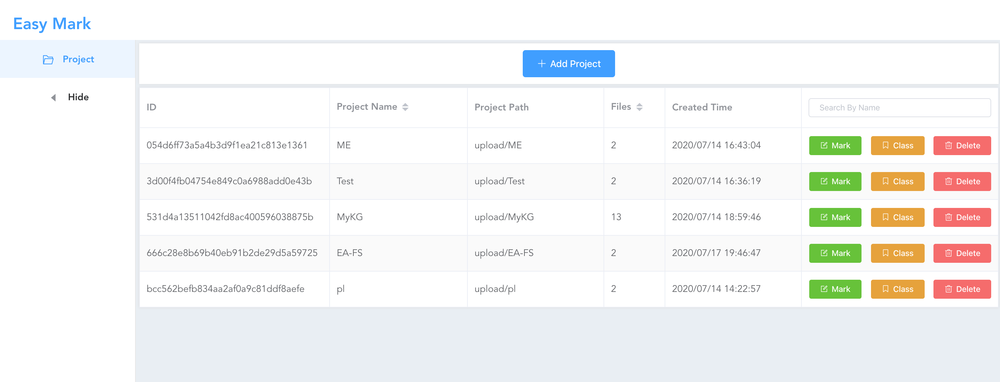
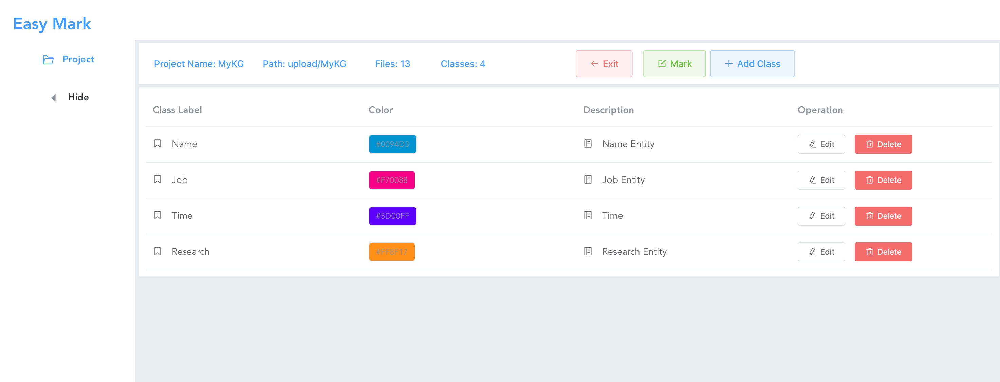

# text_label (Easy Mark)


> A Vue.js project (front-end interface) for marking entities in texts(especially pdf paper).

> A Python project (back-end API) to support Vue data exchange.

> Front-end and Back-end are both independent.

## Functions or Features
- Parse PDF paper into texts(multithreading)
- Add new entity class
- Mark entities in texts
- Support multi-user collaboration
- Commit to the database asynchronously


## Preview
- Project Management


- Class Management


- Work Table


## Database
MySQL

User should import [structure](label_sys.sql) to MySQL.


## Build Setup For Front-end
Before building setup

- (npm run dev) Change ws_port and pdf_port in [src/router/index.js](src/router/index.js)
- (npm run dev) Change NER-API proxy port and Vue project host:port in [config/index.js](config/index.js)
- (npm run build) Replace all axios based api with full api router (e.g. replace **/api/fetch_class** with **https://xxx.yy/api/fetch_class**)

``` bash
# install dependencies
npm install

# serve with hot reload at localhost:8080
npm run dev

# build for production with minification
npm run build

# build for production and view the bundle analyzer report
npm run build --report
```

For a detailed explanation on how things work, check out the [guide](http://vuejs-templates.github.io/webpack/) and [docs for vue-loader](http://vuejs.github.io/vue-loader).

## Build Setup For [Back-end](textlabel_backend)

Add Vue Project Host in [origins](textlabel_backend/apiCore.py) For Security
Configure Database in [config](textlabel_backend/db_toolkit.py)

```bash
# install dependencies
pip install python-multipart
pip install uvicorn
pip install fastapi
pip install aiofiles
pip install aiomysql

# open services
uvicorn apiCore:app --reload --port 8000 --host 0.0.0.0
```

## Developer log
```bash
npm install -g vue-cli

vue init webpack text_label

npm install axios -S
npm i element-ui -S
# npm install goeasy -S not used
```
